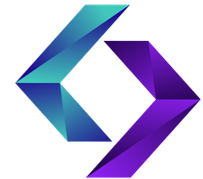

### Hello World! 👋

## My projects at Tuwaiq .NET programming Bootcamp 

---

### `ASP.NET ` 

- **[Blog App](https://github.com/maryam-alraddadi/Project04_Auth_CRUD_ASP.NET)**
- **[HNews](https://github.com/maryam-alraddadi/Project01_ASP.NET_MVC)**
- **[Bookstore](https://github.com/maryam-alraddadi/Project02_EF_ASP.NET_MVC)**

### `React ` 

- **[Kanban Board](https://github.com/maryam-alraddadi/FinalProject)**
- **[Github events viewer](https://github.com/maryam-alraddadi/Project02)**
- **[Todo list](https://github.com/maryam-alraddadi/toDo-list)**
- **[ContactList](https://github.com/maryam-alraddadi/HW_Week11_Day01_React_Redux)**

---

### `Group projects 🤍`

- **[Drawing Engine](https://github.com/Reema3Alyousef/Drawing_Engine_Project)**
- **[XMLProject](https://github.com/Al-Suda/XMLProject)**
- **[Whatsapp Clone](https://github.com/MhmdRashed/WhatsApp-CloneProject)**

---

### `</> 👾`

- **[JSON Tokenizer](https://github.com/maryam-alraddadi/JSONTokenizer)**
- **[Refactoring Kata](https://github.com/maryam-alraddadi/Challenge01)**
- **[SQL101](https://github.com/maryam-alraddadi/SQL101)**
